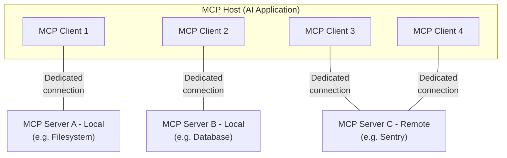

# Model Context Protocol(MCP)

MCP是一个将AI应用程序与连接到外部系统的开源协议。
为了赋予大模型调用工具的能力，需要一种协议，使得大模型能够调用工具暴露的API，得到期望的结果。但由于当前市面上存在各种各样的大模型、各种各样的工具以及各种各样的操作系统，AI应用接入新工具需要复制完整的代码和功能描述，但很多企业不提供源代码，且跨语言的代码不一定能够执行，因此需要一种通用的协议来规范AI应用与工具之间的通信流程。
针对上述问题，模型调用工具分为**本地服务式调用**和**远程服务式调用**
* 本地服务式调用：直接将工具包拉到本地，利用进程间的通信机制将服务运行起来，自动获取工具的描述信息和自动完成调用
* 远程服务式调用：访问工具的远程服务，自动获取工具的描述信息和自动完成调用

**技术思路**：
* 工具与AI应用解耦合
* 工具与AI应用利用统一的通信协议
* 工具与AI应用利用统一的接口
* 工具与AI应用利用统一的数据交换格式
* AI应用接入工具时使用标准化配置内容
* AI应用内部实现标准化的工具加载调用逻辑

## 架构

MCP关键参与者包括：
* MCP主机：用于协调和管理一个或多个MCP客户端
* MCP客户端：维护与MCP服务端之间的连接，并从服务端获取上下文供MCP主机使用
* MCP服务端：一个为MCP客户端提供上下文的程序

MCP包含两层，内层为数据层，外层为传输层：
* 数据层：定义了客户端和服务端之间基于JSON-RPC的对话协议，包括生命周期管理、核心原语，比如工具、资源、提示词和通知。
* 传输层：定义了客户端和服务器之间实现数据交换的通信机制和通道，包括特定于传输的连接建立、消息帧结构和授权。

**数据层**

数据层实现了基于JSON-RPC2.0的交换协议，定义了数据的结构和语义，包括：
* 生命周期管理：处理客户端和服务端之间的连接初始化、能力协商以及连接终止。
* 服务端功能：使服务端能够提供核心功能，包括AI工具、上下文数据资源、来源和来自客户端的交互提示词模板。
* 客户端功能：使服务端能够请求客户端从主机LLM中进行采样，获取用户输入，并向客户端发送日志消息。
* 实用功能：支持添加功能，如实时更新通知和长时间执行的程序跟踪。

**传输层**

传输层负责管理客户端和服务端之间的交流通道和鉴权，处理MCP参与者之间的连接建立、消息格式以及通信安全。MCP支持两种
传输机制：
* STDIO Transport(标准传输)：使用标准输入输出流在同一台主机的本地进程之间进行直接通信，在没有网络的前提下提供最佳性能。
* Streamable HTTP Transport(流式HTTP传输)：使用HTTP POST协议进行客户端和服务端之间的消息通信，并可选择服务器发送事件来得到流式传输能力。这个传输协议支持远程服务端通信，还支持包括持有者令牌、API密钥和自定义标头在内的标准HTTP身份验证方法。MCP建议使用OAuth来获取身份验证令牌。

传输层将通信细节与协议层隔离，从而确保所有通信协议都能够使用相同的JSON-RPC2.0消息格式。

MCP是有状态的协议(流式HTTP传输协议存在无状态的子集)，生命周期管理的目的是协商客户端和服务端所提供的能力。

MCP原语定义了客户端和服务端可以为对方提供什么，原语指定了可以共享给AI应用程序的上下文信息类型以及可执行的操作范围。

MCP定义了三种服务端可以暴露的原语：
* Tools：AI应用程序可以调用执行的函数。(文件操作、API调用、数据库查询)
* Resources：为AI应用程序提供上下文信息的数据源。(文件内容、数据库记录、API响应)
* Prompts：有助于与大模型结构化交互的可复用模板。(系统提示词、少量示例)

MCP客户端可以使用`*/list`方法得到可用的原语，`tools/list`可以查看可用工具，利用`*/get`进行检索。

MCP为客户端定义了三种可暴露的原语，这些原语可以让MCP服务端作者构建更丰富的交互：
* Sampling：利用`sampling/complete`，允许服务器向客户端的AI应用程序请求语言模型补全。
* Elicitation：利用`elicitation/request`，允许服务器向用户请求额外的信息。
* Logging：允许服务端向客户端发送日志信息，以用于debug和监测的目的。

除了服务端和客户端原语，MCP协议还提供了实用原语，用于增强请求的执行方式：
* Tasks(Experimental)：可以MCP请求的延迟结果检索和状态追踪的持久执行封装器。

MCP协议提供实时通知，支持服务端和客户端之间的动态更新，Notifications发送JSON-RPC2.0通知信息(无需响应)和支持MCP服务端向其连接的客户端提供实时更新。

简单总结来说，MCP协议如同一个拓展坞，Cursor、Claude Code、Codex等就是MCP主机，它们打开的代码文件就是一个客户端，利用拓展坞上的接口，服务端便可以提供本地和远程服务。

原语使用方法见[官方文档](https://modelcontextprotocol.io/docs/learn/architecture)